# Discord Emoji Uploader – Full Setup & Code Explained

## What This Script Does

This script allows bot owners to automatically upload all images from a folder as custom emojis into their server.

>💡 If you don’t want to run code, you can also upload emojis via the [Discord Developer Portal](https://discord.com/developers/applications):  
`Select App → Emojis`

>**Note:** Functionally, the code works the same as manually uploading your emoji files in Discord’s developer portal.  This script is mainly for the tech-savvy or those who want to work with the code directly.

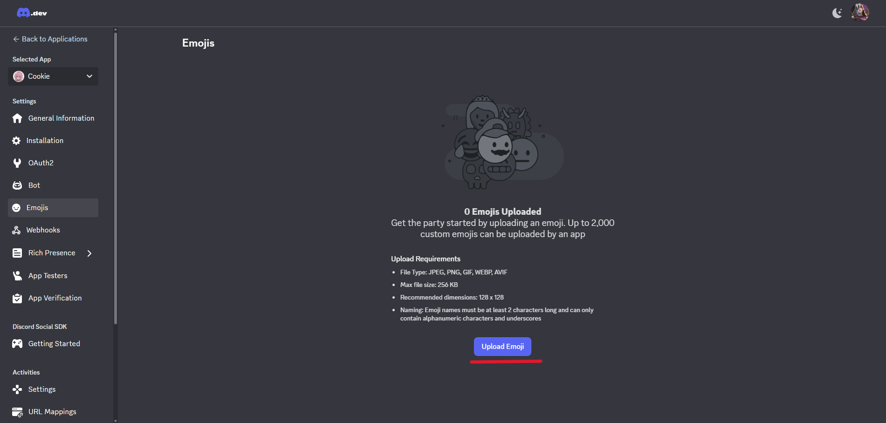

Check out my custom emojis [here](https://ko-fi.com/s/b60e1dd308).

If you feel like supporting my work, donations are welcome [here](https://ko-fi.com/niladoze).
## ⚙️ Prerequisites

Before using the Discord Emoji Uploader, make sure you have the following:

1. **Python 3.x**  
   Download and install from [https://www.python.org/downloads/](https://www.python.org/downloads/)

2. **Discord.py Library**  
   Open your terminal (CMD or PowerShell) and run:
   ```bash
   pip install discord.py
    ```

## 🧭 Summary

This Discord Emoji Uploader guide walks you through everything from creating a bot to running the `/upload_emojis` command. By the end, even someone with zero programming experience should understand it. Here’s what you’ll learn:

✅ **Bot Creation:** How to create a bot in the [Discord Developer Portal](https://discord.com/developers/applications) and get its token.  

✅ **Permissions:** Which permissions the bot needs (Manage Expressions, Create Expressions, View Channels, Send Messages) and how to generate the invite link.

✅ **Environment Setup:** Using environment variables for `DISCORD_TOKEN`, `GUILD_ID`, and `EMOJI_FOLDER` to keep sensitive data safe.  

✅ **Folder Preparation:** How to prepare your emoji folder (`flags`) with supported images under 256 KB.  

✅ **Code Overview:** Step-by-step explanation of the bot code, including:
  - Intents and bot object creation
  - Sanitizing emoji names
  - Looping through files and uploading them
  - Handling errors
  - Sending a summary report

✅ **Running the Bot:** How to launch the bot in PowerShell or CMD and use the `/upload_emojis` command.  

✅ **Common Gotchas:** How to troubleshoot issues like missing permissions, large files, guild not found, or rate limits.


## 1️⃣ Create a Discord Bot

1. Go to [Discord Developer Portal](https://discord.com/developers/applications).  
2. Click **“New Application”**, give it a name (like `Bot`), click **Create**.  
3. Optional: set an icon and description.  

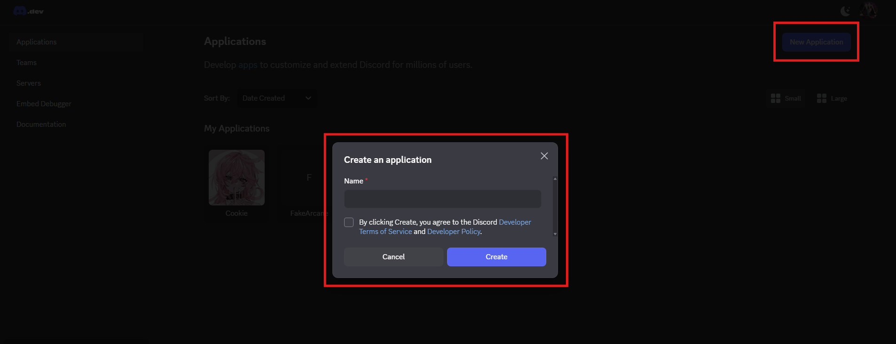
> ✅ You now have a bot. This is what Discord uses to identify your script.

---

## 2️⃣ Enable Intents

1. In the **Bot tab**, scroll down to **Privileged Gateway Intents**.  
2. Enable **Message Content Intent**.  
3. Click **Save Changes**.  

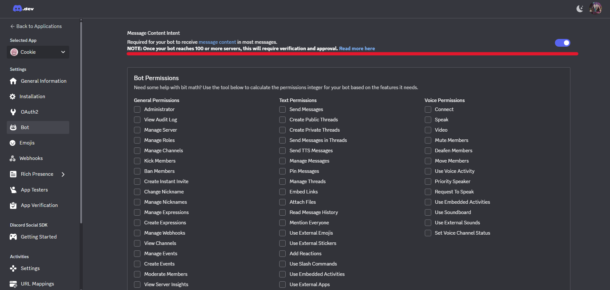
**Why:**  
This allows your bot to read messages in Discord, which is required for commands like `/upload_emojis`.

---

## 3️⃣ Prepare Your Emoji Folder

1. Create a new folder. Alternatively, if you bought my emoji pack you'll be given a folder containing all the emoji images (e.g. `flags`). You can **add or replace** images in this folder to upload **additional emojis** in the same way.    
`C:\..\flags`

2. Make sure all images you want to upload are in this folder.  
Supported formats include: `.png`, `.jpg`, `.jpeg`, `.gif`, `.webp`.  
3. Make sure each image is **under 256 KB** (Discord’s limit).  

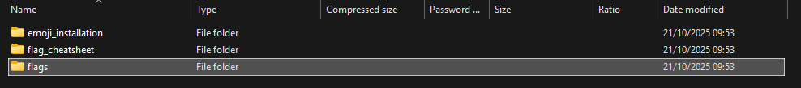
> ✅ Your folder is now ready to feed images to the bot.

---

## 4️⃣ Generate an Invite Link for Your Bot

Customize this link to invite your bot:  
https://discord.com/oauth2/authorize?client_id=APPLICATION_ID&permissions=PERMISSIONS_INTEGER&scope=bot%20applications.commands

### 4a – Find Information

- `APPLICATION_ID` → Developer Portal → General Information  

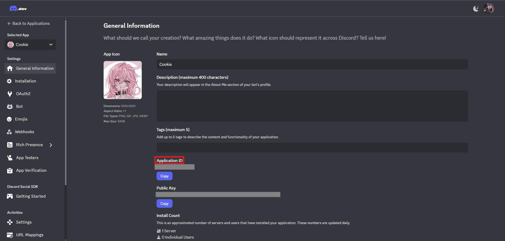
- `PERMISSIONS_INTEGER` → Developer Portal → Bot → Bot Permissions   

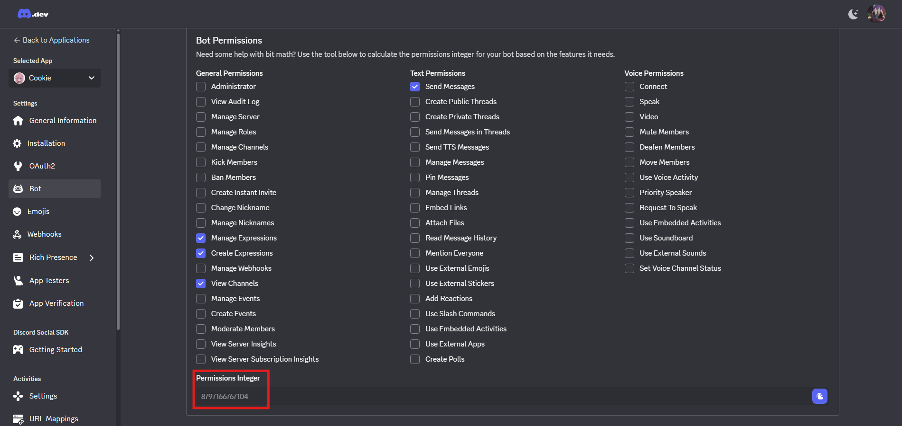
---

### 4b – Calculate the Permissions Integer

Your bot needs:

- **Manage Expressions** → 1073741824
- **Create Expressions** → 8796093022208  
- **View Channels** → 1024  
- **Send Messages** → 2048  

**Add them together:**  
1073741824 + 8796093022208 + 1024 + 2048 = 8797166767104

> This is your `PERMISSIONS_INTEGER`.  

---

### 4c – Build the Final Link

Replace `APPLICATION_ID` and `PERMISSIONS_INTEGER` in the link above. 
Tip: You can optionally save this link under `Developer Portal → Installation → Install Link → Custom URL`.

Open this link → select your server → click **Authorise**. 

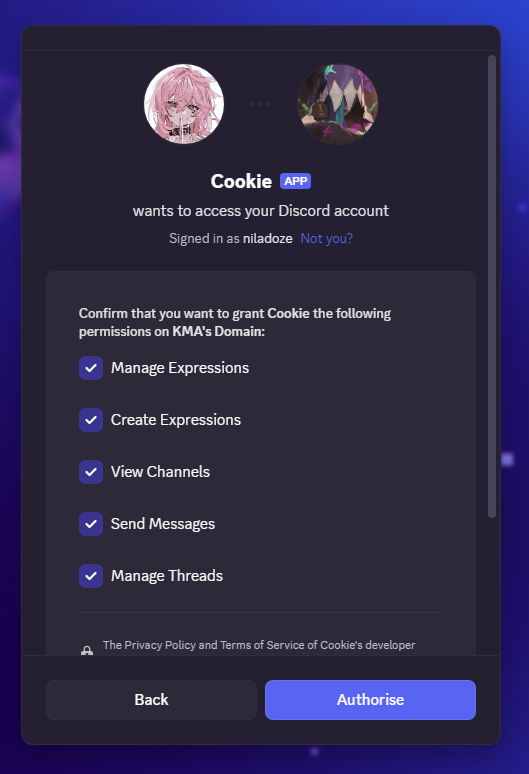

> ⚠️ If your bot will post in private channels, make sure the bot role has **View Channel** and **Send Messages** permissions in the respective channel.

---

## 5️⃣ Set Up the Environment (Optional but Recommended)

Instead of hardcoding (writing fixed values directly in code) sensitive data like your token, you can use **environment variables**:

1. Open PowerShell / CMD(Terminal) and type `cd` and your folder path to `emoji_installation` (alternatively create a new folder where the [python file](#-code) is located at):

 
    
```python
cd "C:\..\emoji_installation"
```

1. Set variables like this:
### Powershell
```powershell
$env:DISCORD_TOKEN="your_bot_token_here"
$env:GUILD_ID="your_guild_id_here"
$env:EMOJI_FOLDER="your_emoji_folder_path_here"
```

### CMD (Terminal)
```cmd
set DISCORD_TOKEN=your_bot_token_here
set GUILD_ID=your_guild_id_here
set EMOJI_FOLDER=your_emoji_folder_path_here
```
>⚠️ Note: These environment variables are only active in the current session.
If you close the terminal, you’ll need to set them again.

- `DISCORD_TOKEN` → your bot token (Developer Portal → Bot).

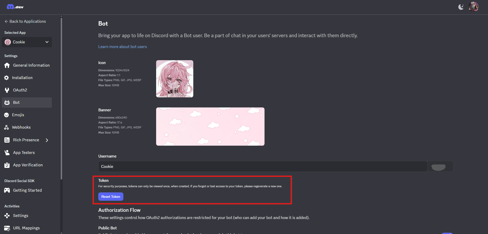
- `GUILD_ID` → your server ID.

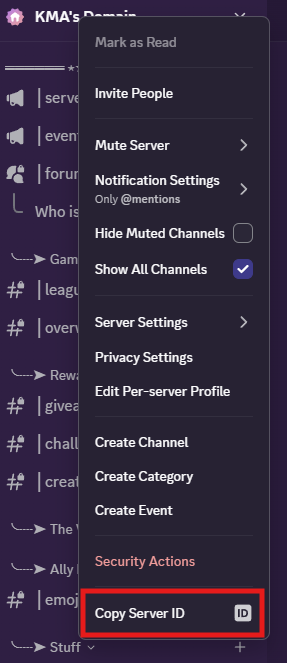
(Right click)
- `EMOJI_FOLDER` → folder path with your emoji images.

Using environment variables keeps your token secret and allows easier sharing of the code.

## 6️⃣ The Bot Code – Explained Line by Line

### 6a – Import Libraries

```python
import os
import re
import asyncio
import discord
from discord.ext import commands
```
- `os` → work with files and folders
- `re` → clean emoji names
- `asyncio` → handle delays; Discord API requires async functions
- `discord` → main library for interacting with Discord
- `commands` → lets you define commands like /upload_emojis

### 6b – Config

```python
TOKEN = os.getenv("DISCORD_TOKEN")
GUILD_ID = int(os.getenv("GUILD_ID", "0"))
FOLDER_PATH = os.getenv("EMOJI_FOLDER", "./flags")
```
- Reads environment variables if set; defaults to `./flags` if not.
- Keeps sensitive info like your token out of the code.

### 6c – Intents and Bot Object

```python
intents = discord.Intents.default()
intents.message_content = True
bot = commands.Bot(command_prefix="/", intents=intents)
```

- `Intents.default()` → default permissions for your bot
- `message_content=True` → lets the bot read messages
- `commands.Bot(...)` → creates the bot with / prefix and the intents

### 6d – Helper Function: sanitize_emoji_name

```python
def sanitize_emoji_name(file_name):
    sanitized = file_name.rsplit('.', 1)[0]
    sanitized = re.sub(r'[^A-Za-z0-9_-]', '', sanitized)
    if len(sanitized) < 2:
        sanitized = "emoji"
    return sanitized[:32]
```
- Removes file extension (`.png`, etc.)
- Keeps only letters, numbers, `_` and `-` in the name
- Defaults to `"emoji"` if the name is too short
- Limits to 32 characters (Discord max)

### 6e – Command Definition

```python
@bot.command(name="upload_emojis")
async def upload_emojis(ctx):
```
- Creates `/upload_emojis` command
- `ctx` contains info about who ran the command and where

### 6f – Check Guild and Folder

```python
guild = bot.get_guild(GUILD_ID)
if guild is None:
    await ctx.send("Error: Bot not in guild or wrong GUILD_ID.")
    return

if not os.path.isdir(FOLDER_PATH):
    await ctx.send(f"Error: folder not found: {FOLDER_PATH}")
    return
```

- Ensures bot is in your server and the folder exists

### 6g – Loop Through Files

```python
for file_name in os.listdir(FOLDER_PATH):
    file_path = os.path.join(FOLDER_PATH, file_name)
    if not os.path.isfile(file_path) or not file_name.lower().endswith((".png", ".jpg", ".jpeg", ".gif", ".webp")):
        skipped += 1
        continue
```
- Skips files bigger than 256 KB

### 6i – Read File and Upload Emoji

```python
emoji_name = sanitize_emoji_name(file_name)
try:
    with open(file_path, "rb") as f:
        image_bytes = f.read()
    new_emoji = await guild.create_custom_emoji(name=emoji_name, image=image_bytes)
    await ctx.send(f"Uploaded: {new_emoji} (:{new_emoji.name}:)")
    uploaded += 1
    await asyncio.sleep(1)
```

- Reads image in binary mode
- `create_custom_emoji` → uploads to server
- Sends a confirmation message
- Waits 1 second to avoid hitting Discord rate limits

### 6j – Handle Errors

```python
except discord.Forbidden:
    await ctx.send("I don't have permission to manage emojis in this server.")
    return
except Exception as e:
    await ctx.send(f"Failed {file_name}: {e}")
    skipped += 1
```
- `Forbidden` → bot lacks permissions
- Other errors → skips emoji and reports it

### 6k – Summary Message

```python
await ctx.send(f"Done. Uploaded: {uploaded}, skipped: {skipped}")
```

- Sends a final report of uploaded/skipped emojis

### 6l – Run the Bot

```python
bot.run(TOKEN)
```

- Connects the bot to Discord and starts listening for commands

## 7️⃣ Running the Bot

1. Open PowerShell / CMD and type `cd` and your folder path to `emoji_installation`:
    ```python
    cd "C:\..\emoji_installation"
    ```
2. Type this to run the code:
    ```python
    python uploademojis_command.py
    ```
Your terminal should say something like:
```python
INFO:discord.client:logging in using static token
INFO:discord.client:connected to gateway
```
and your bot should appear online.

## 8️⃣ Use the command
In a text channel where your bot can read and write messages, type: `/upload_emojis`
- The bot will upload all emojis in your folder automatically

You’ll see messages like:
```python
Uploaded: 🏳️‍🌈 (lgbtq)
Done. Uploaded: 1, skipped: 0
```
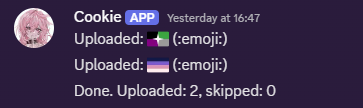
>⚠️ For private channels: make sure the bot can **View Channel** and **Send Messages** there.
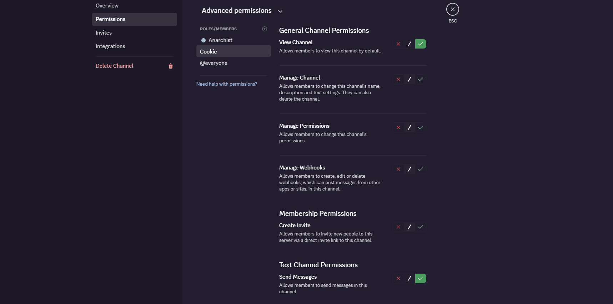
## 🧨 Common Gotchas

| Problem                     | Fix                                                                                     |
|------------------------------|----------------------------------------------------------------------------------------|
 “Forbidden” error            | The bot doesn’t have **Manage Expressions** or **Create Expressions** permissions in that server.         |
 Guild not found              | The `GUILD_ID` is wrong or the bot isn’t in that server.                                |
 Large file error             | Resize or compress the image below ~256 KB.                                             |
 Rate limit / too many requests | Keep the `asyncio.sleep(1)` delay.                                                     | |

---
## <> Code

1. Copy the code below into a text editor.
2. Save it as `uploademojis_command.py` (not .txt)
3. Ensure [`Python`](#%EF%B8%8F-prerequisites) and [`discord.py`](#%EF%B8%8F-prerequisites) are installed
```python
import os
import re
import asyncio
import discord
from discord.ext import commands

TOKEN = os.getenv("DISCORD_TOKEN")           # set DISCORD_TOKEN in your environment
GUILD_ID = int(os.getenv("GUILD_ID", "0"))   # set GUILD_ID in your environment (as a number)
FOLDER_PATH = os.getenv("EMOJI_FOLDER", "./flags")  # path to folder with images

intents = discord.Intents.default()
intents.message_content = True
bot = commands.Bot(command_prefix="/", intents=intents)

def sanitize_emoji_name(file_name):
    sanitized = file_name.rsplit('.', 1)[0] 
    sanitized = re.sub(r'[^A-Za-z0-9_-]', '', sanitized)  
    if len(sanitized) < 2:
        sanitized = "emoji"
    return sanitized[:32]

@bot.command(name="upload_emojis")
async def upload_emojis(ctx):
    guild = bot.get_guild(GUILD_ID)
    if guild is None:
        await ctx.send("Error: bot is not in that guild or GUILD_ID is wrong.")
        return

    if not os.path.isdir(FOLDER_PATH):
        await ctx.send(f"Error: folder not found: {FOLDER_PATH}")
        return

    uploaded = 0
    skipped = 0

    for file_name in os.listdir(FOLDER_PATH):
        file_path = os.path.join(FOLDER_PATH, file_name)

        if not os.path.isfile(file_path):
            continue
        if not file_name.lower().endswith((".png", ".jpg", ".jpeg", ".gif", ".webp")):
            skipped += 1
            continue

        size_bytes = os.path.getsize(file_path)
        if size_bytes > 256 * 1024:  # 256 KB threshold (adjust if needed)
            await ctx.send(f"Skipping {file_name} (file too large: {size_bytes} bytes)")
            skipped += 1
            continue

        emoji_name = sanitize_emoji_name(file_name)

        try:
            with open(file_path, "rb") as f:
                image_bytes = f.read()

            new_emoji = await guild.create_custom_emoji(name=emoji_name, image=image_bytes)
            await ctx.send(f"Uploaded: {new_emoji} (:{new_emoji.name}:)")
            uploaded += 1

            await asyncio.sleep(1)

        except discord.Forbidden:
            await ctx.send("I don't have permission to manage emojis in that server.")
            return
        except discord.HTTPException as e:
            await ctx.send(f"Failed to upload {file_name}: {e}")
            skipped += 1
        except Exception as e:
            await ctx.send(f"Unexpected error for {file_name}: {e}")
            skipped += 1

    await ctx.send(f"Done. Uploaded: {uploaded}, skipped: {skipped}")

if not TOKEN:
    print("Missing DISCORD_TOKEN environment variable.")
else:
    bot.run(TOKEN)


```


